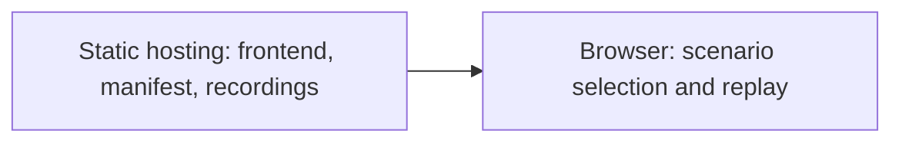
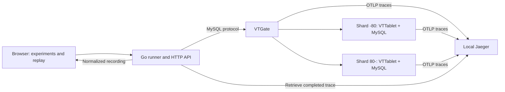

# Vitess Query Visualizer Specification

## Purpose

Working name: `shardyssey`.

Build a visual learning tool for Vitess around this question:

> I sent one query. What did all these machines do to answer it?

The first audience is a developer learning distributed SQL. The public experience lets the user select query and delay scenarios and replay pre-generated recordings of real cluster executions. New executions are captured locally by the developer. The finish line is a working, explainable demonstration of routing, fan-out, and waiting for a slow branch.

## first experience

1. Open the page and see a client, VTGate, and two shard machines.
2. Choose one of three experiments and see its SQL and prediction prompt.
3. Load the real recording for the selected scenario.
4. Replay the recorded execution. Pause, scrub, or slow it down.
5. Click a branch to inspect the shard, component, duration, and evidence.
6. Select another recorded query or delay scenario and compare the behavior.

The explanation should arise from the visual change: adding a sharding-key filter removes branches; removing it introduces fan-out; delaying a required branch delays the complete answer.

## hosting and capture model

The public application is a static website. Deploy only the frontend, an experiment manifest, and pre-generated recording JSON with the evidence needed for inspection. The website does not require a hosted database, Go backend, Jaeger instance, or Vitess cluster.

Generate recordings locally against the real demo cluster using the Go runner and Jaeger. Export validated recordings into `web/public/recordings/` and their scenario manifest into `web/public/experiments.json`. Bundle the required topology snapshot and sanitized evidence with each published recording. Never export credentials, private connection details, or unrelated traces.

Visitors can select scenarios, play, pause, scrub, change playback speed, inspect branches, and compare recorded runs. A query selector or delay selector chooses an existing recording; it does not execute SQL or inject a new fault. Use labels such as `Load recording` and `Recorded execution` so this is clear. Only offer parameter combinations with captured data; do not interpolate timings to invent unrecorded runs.

Developers can run fresh experiments locally through the capture API. Public execution of arbitrary queries or visitor-controlled fault injection is outside v0.

## cluster

Use Vitess v24, with an exact patch version and image digest pinned during setup. The v24 documentation describes OpenTelemetry support; actual flags and emitted spans must be verified against the pinned binary.

- One VTGate, serving the MySQL protocol.
- One sharded keyspace, `demo`.
- Two shards, `-80` and `80-`.
- One primary VTTablet and MySQL instance per shard.
- The topology service and VTctld needed to initialize and inspect the cluster.
- No replicas in v0.

Local development uses separate containers. The demonstration can use three Linux hosts or VMs: gateway/control services on one, and one tablet/MySQL pair on each of the other two. Containers on one laptop must be described as separate services, not separate physical machines. A single configuration describes both layouts; cloud provisioning is outside the implementation scope.

## schema and experiments

Use a small, deterministic `events` dataset:

```sql
CREATE TABLE events (
  user_id BIGINT NOT NULL,
  event_id BIGINT NOT NULL,
  category VARCHAR(32) NOT NULL,
  PRIMARY KEY (user_id, event_id)
);
```

Configure a hash primary vindex on `user_id` in the VSchema. A vindex maps the key to a shard. Seed both shards and verify their contents; consecutive IDs need not map to consecutive shard ranges.

| Experiment | Query | Expected lesson |
|---|---|---|
| One shard | `SELECT COUNT(*) FROM events WHERE user_id = 42` | The vindex lets VTGate target one shard. |
| Fan-out | `SELECT COUNT(*) FROM events` | Both shards contribute partial answers. |
| Slow branch | Same fan-out query, with one tablet path deliberately delayed | A complete aggregate waits for the required branch. |

For the third case, apply controlled network delay to one tablet RPC path using a demo-only fault mechanism, initially Linux traffic control in an isolated namespace. Verify that the mechanism changes the intended path and does not affect both shards. Restore it after every run, including failures. Start with a visible delay around 500 ms and adjust after measuring the actual effect.

Label it `injected network delay`. A long tablet RPC span is not evidence of slow MySQL execution or a lock. Ordinary span timing cannot separate network, queuing, and execution unless additional instrumentation exposes those intervals.

## architecture

### public playback



### local capture



**Stack:** Go for the runner and trace normalization; TypeScript, React, and SVG for the interface; Jaeger as the local OTLP trace receiver/store. SVG is sufficient for a small graph and supports inspectable labels and accessible controls. No Kafka, custom collector, or adapter framework is needed.

The Go runner owns database access during local capture. Its local interface submits an experiment ID and bounded parameters, not arbitrary SQL. Only one capture experiment runs at a time in v0. The public browser loads static assets and never calls the capture API.

## evidence and trace capture

Use three sources with distinct meanings:

1. **Topology:** obtain shard/tablet identities from Vitess topology tooling and record them with the run. A demo manifest describes host placement; topology confirms tablet assignments.
2. **VEXPLAIN:** `VEXPLAIN PLAN` explains the route without executing the query. `VEXPLAIN QUERIES` executes it and returns shard SQL interactions. `VEXPLAIN TRACE` adds operator execution statistics. These establish routing and operator behavior, not a timestamped network timeline.
3. **OpenTelemetry:** capture VTGate and VTTablet spans for measured intervals and parent-child relationships. Enable full sampling only in the small controlled demo. Use supported context propagation if verified; otherwise isolate runs, correlate conservatively, and refuse ambiguous captures.

The ordinary query, its VEXPLAIN executions, and repeated comparison runs are separate executions. Store separate IDs and never combine them into a fictional single trace. Explain output can validate a route under identical deterministic conditions, but is not automatically evidence of what another run did.

After a query returns, wait for exported spans with a bounded timeout. Incomplete captures receive an explicit warning and cannot claim that missing branches did not run. Do not present completed-span export as instantaneous live monitoring.

### first implementation gate

Before frontend work, produce raw captures showing:

- the correct shard for the key-filtered query;
- both shards for the aggregate;
- one complete root trace with identifiable tablet branches;
- branch timestamps and durations for the delayed aggregate;
- a defensible mapping from a traced branch to a tablet and shard;
- an observed total duration consistent with the intentionally delayed branch.

Save topology, query results, VEXPLAIN output, and raw traces as fixtures. Verify service names, attributes, propagation, retries, and clock behavior against the actual release instead of guessing field names.

If per-shard timing cannot be recovered reliably, ship a narrower route explainer from VEXPLAIN with timing marked unavailable. Do not make a timed animation from guessed or evenly divided durations. The full timing demo remains unfinished until this gate passes.

## recording contract

Each recording contains:

```text
schema_version, run_id, experiment_id
vitess_version, topology_snapshot, query_template, parameters
fault_configuration, client_elapsed_ms, query_result
trace_id, capture_status, raw_evidence_paths
spans[]: id, parent_id, service, operation, start, end, status
branches[]: shard, tablet, supporting_span_ids, identity_source
explain_runs[]: separate run IDs, format, raw output
```

Unknown fields remain null. Repeated RPCs remain separate spans. Preserve original timestamps and per-span durations. Across physical hosts, measure clock skew and use parent relationships for causality; show timing uncertainty where ordering cannot be established. Do not silently align every branch to the same start time.

## visual specification

The main view is `client → VTGate → shard machines`, with the shard and its VTTablet/MySQL roles labeled. A timeline sits below it and shares the replay cursor.

- Untouched nodes remain visible but muted.
- A captured branch highlights its route for its measured RPC interval.
- Completed branches fade while an outstanding branch remains highlighted.
- The result appears when the captured root operation completes.
- Each branch has a duration label and an evidence panel.
- The injected delay is visible as an experiment annotation.
- A compare control places baseline and delayed runs side by side.
- Decorative pulses indicate a connection, not packet counts or row progress.

Do not animate a separate MySQL stage unless the trace actually measures it. Show the tablet/MySQL pair as one shard service otherwise. Present a replay speed label so slowed animation cannot be mistaken for measured wall time. Provide reduced-motion playback and keyboard-accessible controls.

## API and repository shape

The API below is for local capture only. Public playback uses the static manifest and recording files.

```text
GET  /api/experiments
GET  /api/topology
POST /api/runs                    experiment ID and allowed parameters
GET  /api/runs/{id}               pending, capturing, complete, or failed
GET  /api/runs/{id}/recording
GET  /api/runs/{id}/evidence

cmd/shardyssey/                   working executable name
internal/runner/                  experiment execution and lifecycle
internal/vitess/                  SQL and topology access
internal/traces/                  Jaeger retrieval and normalization
internal/recording/               versioned recording contract
internal/server/                  HTTP API
web/                             experiment page and SVG replay
web/public/experiments.json       published scenario manifest
web/public/recordings/            validated recordings and sanitized evidence
demo/                            cluster, schema, seed, fault controls
fixtures/                        measured runs and parser fixtures
```

Bind locally by default. Keep database credentials on the server. Use only seeded demo data in published recordings. Apply query deadlines and bounded output sizes. Fault injection is confined to the included demo environment; importing recordings does not require access to a database.

## project phases

Build these phases in order. Each phase ends with a runnable, inspectable deliverable. Phases 1–2 establish the evidence; phase 3 produces the first visual demo; phases 4–5 complete the learning experience; phase 6 makes it reproducible and ready to share.

### phase 1: a real query across shards

**Goal:** understand and prove the cluster behavior before drawing it.

- Start the pinned Vitess cluster with two seeded shards.
- Run the one-shard query and the fan-out aggregate from the terminal.
- Capture topology and VEXPLAIN output for each experiment.
- Enable tracing and reproduce the deliberately delayed branch.
- Check whether traces expose reliable branch identity and timing.

**Deliverable:** cluster startup instructions and raw evidence for all three experiments.

**Done when:** the first implementation gate above passes. If branch timing is unavailable, explicitly reduce the scope to a route explainer before continuing; timed replay remains blocked on this evidence.

### phase 2: turn evidence into recordings

**Goal:** give the frontend a small, consistent representation of an actual run.

- Implement the Go experiment runner and bounded trace retrieval.
- Normalize topology, spans, branch identities, and results into the recording contract.
- Keep VEXPLAIN executions separate from ordinary query traces.
- Preserve unknown fields, repeated RPCs, and incomplete-capture warnings.
- Add fixture checks for correct routing, ambiguous correlation, and missing spans.

**Deliverable:** recording JSON for each experiment, with links to its raw evidence.

**Done when:** each displayed branch and measured interval can be traced back to its source, and ambiguous captures are rejected or clearly marked incomplete.

### phase 3: watch one query travel

**Goal:** make the first complete visual interaction work.

- Render the client, VTGate, and two labeled shard services in SVG.
- Load a real one-shard recording.
- Add play, pause, replay speed, and timeline scrubbing.
- Highlight the touched branch and leave the other shard muted.
- Let the user inspect the branch duration and supporting evidence.

**Deliverable:** an end-to-end replay of the one-shard experiment.

**Done when:** the graph and timeline agree at every cursor position, unknown timing is not animated as measured, and the result appears at the recorded completion point.

### phase 4: make fan-out understandable

**Goal:** show how changing the query changes the distributed work.

- Add the fan-out experiment using its actual captured branches.
- Show both shards contributing to the aggregate.
- Compare the one-shard and fan-out queries, keeping their SQL visible.
- Explain routing and the aggregate merge using the captured plan.

**Deliverable:** a visual comparison of one-shard routing and fan-out.

**Done when:** the user can change the experiment and see which branches change, with every highlighted route supported by evidence. The explanation does not assume an aggregate implementation the plan does not show.

### phase 5: show why one slow branch matters

**Goal:** turn the visualizer into an interactive learning experiment.

- Add the bounded local-capture network-delay control and reliable cleanup.
- Export baseline and delayed recordings; the public delay selector loads those captures.
- Run baseline and delayed fan-out captures.
- Compare them side by side with measured durations and replay speed labels.
- Show completed branches while the delayed branch remains outstanding.
- Explain why this complete aggregate needs the delayed contribution.

**Deliverable:** the full three-experiment interactive guide.

**Done when:** the injected delay affects the intended tablet path, the recordings show its effect on completion, and the interface labels the cause as injected network delay rather than guessing database slowness. Cleanup works after success, cancellation, and failure.

### phase 6: reproduce and share it

**Goal:** make the finished experiment usable by someone else.

- Document startup, capture, playback, fault cleanup, and measured limitations.
- Bundle the scenario manifest, recordings, and sanitized evidence with the static website.
- Document a static-host deployment that requires no backend or running database.
- Verify the separate-host layout and label the actual deployment accurately.
- Check keyboard controls and reduced-motion playback.
- Record a short demonstration and write a concise technical explanation.

**Deliverable:** a reproducible repository, interactive guide, and demo video.

**Done when:** a clean checkout reproduces all three cases through the documented flow, and the published static website supports every replay and comparison without access to the capture API, database, or tracing backend. A separate-machine demonstration is complete only after it has actually run on separate hosts or VMs.

## final acceptance

Done means a clean checkout can reproduce all three cases; the graph agrees with raw evidence; the slow branch explains the measured completion behavior; and another developer can explain the three lessons after using it. The public static site must work while all local capture services are stopped. No mocked traffic may substitute for the captured demo.

## scope boundary

v0 covers these three read-only experiments and recorded playback. Arbitrary SQL, writes, transactions, replicas, failover, resharding, production attachment, throughput heatmaps, and automatic tuning are later possibilities. Finish the small guide before expanding it.

Vitess already provides explain and tracing tools. The contribution is an interactive experiment and visual explanation built from those tools.

## sources

- [Vitess v24 tracing](https://vitess.io/docs/24.0/user-guides/configuration-advanced/tracing/): component tracing and OTLP export; validate configuration on the pinned release.
- [Vitess VEXPLAIN](https://vitess.io/docs/24.0/user-guides/sql/vexplain/): planned routes, executed shard interactions, and operator statistics.
